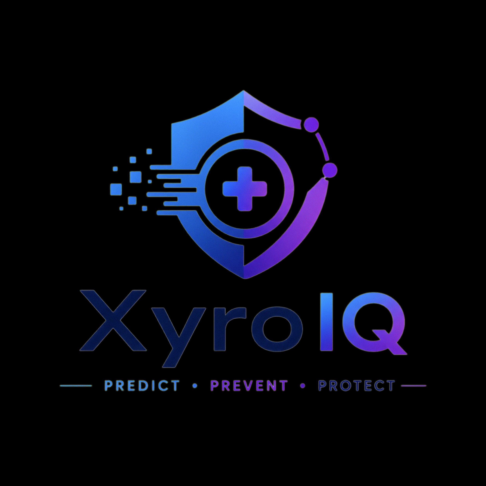

# Xyro IQ
### AI-Powered Prior Authorization Intelligence for Healthcare RCM

<p align="center">
  
</p>

<p align="center">
  <a href="https://rejctx080.github.io/XyroIQ">
    
  </a>
  &nbsp;
  
  &nbsp;
  
  &nbsp;
  
</p>

---

> **"The best time to prevent a denial is before you submit the claim."**

---

## Why Xyro IQ  The Strategic Case

**For prior authorization coordinators and clinical documentation teams**, Xyro IQ improves the decision on **whether a prior authorization request is ready to submit**  inside the pre-authorization workflow, between service scheduling and claim filing  using payer-specific documentation rules, real-time quality scoring, and exception routing  to **reduce first-pass denial rates and days in authorization-related A/R.**

### Where It Sits in the Workflow

```
Service Scheduled
       ↓
Auth Request Initiated
       ↓
[ ★ XYRO IQ AUTH CHECK ]  ← This is where Xyro IQ operates
   • Score documentation quality
   • Match payer-specific criteria
   • Flag missing evidence
   • Route: Submit / Review / Block / Appeal
       ↓
Payer Submission
       ↓
Claim Adjudicated
```

**Who owns it:** Authorization coordinators, clinical documentation staff, auth specialists with escalation to coding, clinical documentation, or provider office.

**When they act:** Before service delivery and again before claim submission.

**Actions that follow:** Proceed with submission, obtain additional documentation, correct payer mismatch, escalate for specialist review, or generate appeal.

### Value Hypothesis

> If Xyro IQ reduces first-pass prior authorization denials by 5 percentage points  from the 12% industry baseline to approximately 7%  the business value per 10,000 monthly authorizations is:

| Metric | Value |
|--------|-------|
| Denials avoided per month | ~500 |
| Avoided rework cost (@ $118/denial) | ~$59,000/month |
| Recovered claim revenue (@ 54% recovery rate) | ~$945,000/month |
| Auth coordinator time recaptured | ~35% capacity freed |
| **Estimated annual revenue impact** | **$1.2M – $4.2M** |

*Projections based on MGMA 2024, HFMA 2025, AMA PA Survey 2024, Kodiak Solutions 2026.*

---

## The Problem

Prior authorization is the single largest administrative burden in US healthcare RCM  costing the system an estimated **$41–56 billion annually** (IDC, 2025).

- **12% of all claims** are denied on first submission (Optum RCM Index, 2024)
- **65% of denied claims are never reworked**  permanent revenue loss
- **$118 average cost** to rework a single denied claim (HFMA)
- **13 hours per week** lost per physician to PA administrative burden (AMA, 2024)
- Over half of all denials trace back to **documentation gaps**  not bad clinical decisions

The root cause: billing teams submit without knowing whether their documentation meets each payer's specific criteria. The check happens after denial  never before.

**Xyro IQ moves that check to before submission.**

---

## The Solution

Xyro IQ is a **pre-submission prior authorization intelligence layer** that sits between clinical documentation and payer submission. It scores documentation quality, predicts authorization likelihood, identifies gaps against payer-specific criteria, and routes every case to the correct action  before a single claim is filed.

This is not denial management. This is **denial prevention.**

---

## Core Features

### Real Working Features *(functional in prototype)*

#### Authorization Likelihood Scoring
Keyword-matching engine against payer-specific rule sets. Produces a percentage score reflecting how well current documentation satisfies the payer's approval criteria for the specific CPT code.

#### Documentation Quality Score  4-Factor Analysis
```
Specificity    (30%)  →  Dates, doses, durations, measurements present
Completeness   (30%)  →  All required note sections documented
Consistency    (20%)  →  CPT code aligns with diagnosis and specialty
Payer Alignment(20%)  →  Payer-specific language and criteria satisfied
```
A HIGH likelihood + LOW quality score = still a denial risk. Both scores must align.

#### Approval Path Optimizer
Shows exactly what documentation to add, step by step, with the probability improvement each addition provides. Not just "what is missing"  but "add THIS and your likelihood moves from 52% to 71%."

#### Evidence Pack Builder
Extracts the exact supporting sentences from existing clinical notes and organizes them into a payer-ready submission packet. **Never fabricates clinical information.** Only surfaces what already exists in the documentation.

#### Smart 5-Tier Action Routing
```
95%+ HIGH confidence        →  Auto Submit to Payer Portal
80–94% HIGH confidence      →  Submit with supervisor note
80%+ MODERATE confidence    →  Escalate to Auth Specialist
50–79% any confidence       →  Clinical Team Alert
Below 50%                   →  Submission Blocked  resolve gaps first
Facility policy violation   →  Clinical Policy Alert  immediate block
```

#### One-Click Appeal Letter Generator
Generates a formal payer-specific appeal letter pulling only from existing clinical note content. References documented findings, states medical necessity, addresses payer criteria gaps. Copy to clipboard in one click.

#### Payer-Specific Facility Intelligence
```
⛔ CLINICAL POLICY VIOLATION  UnitedHealthcare
Cardiac catheterization at outpatient center will be denied.
UHC requires inpatient hospital setting for CPT 93458.
```

---

### Simulated Features *(UI/demo only  labeled in-app)*

These sections are visual demonstrations of production capabilities. All labeled "Simulated Prototype Feature" in the UI.

- Revenue dashboard dollar metrics
- 835 ERA file ingestion and parsing
- CARC/RARC real-time import
- Policy drift detection alerts
- Weekly denial intelligence reports
- Live payer portal integrations
- Long-term analytics persistence

---

## Payer Intelligence Coverage

| Payer | 72148 MRI | 93458 Cardiac Cath | 97110 PT Exercise | 97140 Manual Therapy | 99213 Office Visit |
|-------|-----------|-------------------|-------------------|---------------------|-------------------|
| BCBS | ✅ | ✅ | ✅ | ✅ | ✅ No Auth |
| UHC | ✅ | ✅ ⚠️ Facility Critical | ✅ | ✅ | ✅ No Auth |
| Aetna | ✅ | ✅ | ✅ |  | ✅ No Auth |
| Cigna | ✅ |  | ✅ |  | ✅ No Auth |
| Medicare | ✅ |  | ✅ No Auth |  | ✅ No Auth |

**UHC Special Rule:** CPT 93458 (Left Heart Catheterization) requires inpatient hospital facility. Outpatient center submissions are blocked immediately with policy violation alert.

---

## Test Scenarios

Load pre-built scenarios in the EHR tab to instantly test different outcomes:

| Scenario | Payer | CPT | Expected Result |
|----------|-------|-----|-----------------|
| ✅ Complete Documentation | BCBS | 72148 | ~95% HIGH  Submit |
| ⚠️ Borderline Documentation | BCBS | 72148 | ~68% MODERATE  Review |
| ❌ Incomplete Notes | BCBS | 72148 | ~35% LOW  Blocked |
| ✅ Cardiac Emergency | UHC | 93458 | ~92% HIGH  Submit |
| ❌ Wrong Facility | UHC | 93458 | Policy violation  Blocked |
| 🏃 PT Authorization | BCBS | 97110 | ~88% HIGH  Submit |
| ✅ Office Visit | BCBS | 99213 | 100%  No Auth Required |

---

## Specialty Coverage

| Specialty | Visit Tracking | Re-Auth Threshold | Key Focus |
|-----------|---------------|-------------------|-----------|
| Physical Therapy (PT) | ✅ | Every 6–8 visits | Functional progress, measurable goals, visit limits |
| Occupational Therapy (OT) | ✅ | Every 6–8 visits | ADL outcomes, functional deficit documentation |
| Speech Therapy (ST) | ✅ | Per payer | Baseline language/swallowing assessment required |
| Cardiology |  | Per procedure | Facility type critical (UHC), acute vs elective |
| Orthopedics |  | Per procedure | Step therapy documentation (PT + medication trial) |

---

## Competitive Positioning

| Capability | Xyro IQ | Traditional RCM Tools |
|-----------|---------|----------------------|
| Pre-submission denial prediction | ✅ | ❌ |
| Payer-specific documentation rules | ✅ | Partial |
| Documentation Quality Score (4-factor) | ✅ | ❌ |
| Approval Path Optimizer | ✅ | ❌ |
| Evidence Pack Builder | ✅ | ❌ |
| Facility restriction detection | ✅ | ❌ |
| One-click appeal letter generation | ✅ | Partial |
| CARC/RARC categorization | ✅ | Partial |
| PT specialty visit limit tracking | ✅ | ❌ |
| Fraud prevention guardrails | ✅ | ❌ |
| Zero setup required | ✅ | ❌ |

---

## Fraud Prevention

Xyro IQ is built with compliance at its core.

> Xyro IQ analyzes existing clinical documentation only. The system never generates, suggests, or modifies clinical facts. All clinical documentation must be completed by licensed healthcare providers. Any addition to medical records must reflect actual clinical events.

**Applicable regulations:**
- False Claims Act (31 U.S.C. §§ 3729–3733)
- Anti-Kickback Statute (42 U.S.C. § 1320a-7b(b))
- HIPAA Privacy Rule (45 CFR Parts 160 and 164)

---

## Technology Stack

```
Frontend     →  HTML5, CSS3, Vanilla JavaScript
Rule Engine  →  JSON-based payer rules (payer_rules.json)
AI Engine    →  Rule-based NLP scoring (prototype)
             →  Claude API / LLM integration (production)
Rules DB     →  JSON (prototype) → PostgreSQL (production)
Hosting      →  GitHub Pages (prototype)
             →  Cloud infrastructure, HIPAA-compliant (production)
```

**No installation. No server. No API key. No backend.**
Open `index.html` in any browser and it works.

---

## Production Architecture (Roadmap)

### Phase 1  MVP (Current Prototype)
- Payer rule engine (BCBS, UHC, Aetna, Cigna, Medicare)
- Authorization Likelihood + Documentation Quality scoring
- Approval Path Optimizer + Evidence Pack Builder
- Smart action routing + appeal generation
- Denial analytics dashboard (simulated)

### Phase 2  Pilot
- Claude AI / LLM integration for true clinical NLP
- Real 835 ERA file parsing (ANSI X12)
- EHR integration via HL7 FHIR R4 API
- Python/FastAPI backend with audit logging
- Pilot with 1–2 Infinx RCM clients

### Phase 3  Enterprise
- HIPAA-compliant cloud infrastructure (AWS)
- Payer portal connections via clearinghouse
- Multi-user authentication and role management
- ML model trained on historical denial patterns
- Real-time payer policy change detection
- MS Teams Agent integration (via Developer Tool)
- Predictive PT visit limit alerts
- P2P deadline tracking and escalation

---

## Run Locally

No installation required. No server needed. No API key needed.

```bash
# Clone the repository
git clone https://github.com/RejctX080/XyroIQ.git

# Navigate to folder
cd XyroIQ

# Open in browser
open index.html
```

Or visit the **[Live Demo](https://rejctx080.github.io/XyroIQ)** directly.

---

## Disclaimer

Xyro IQ is a **prototype** demonstrating an AI-powered prior authorization intelligence concept for healthcare RCM.

- All patient data in the demo is entirely fictional
- Clinical scenarios are for demonstration purposes only
- Dashboard analytics are simulated  not derived from real claim data
- Not HIPAA-compliant in current prototype form
- Probability scores are illustrative  production accuracy depends on real payer data and ML model training
- This tool does not constitute medical, legal, or financial advice
- Production deployment requires compliant infrastructure, security audit, and regulatory review

---

<p align="center">
  <strong>Xyro IQ</strong><br/>
  AI-Powered Prior Authorization Intelligence<br/><br/>
  <em>Predict &bull; Prevent &bull; Protect</em>
</p>
